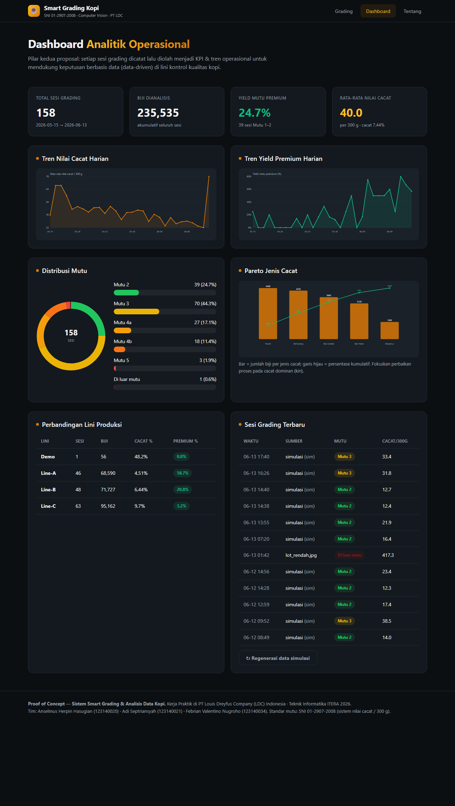
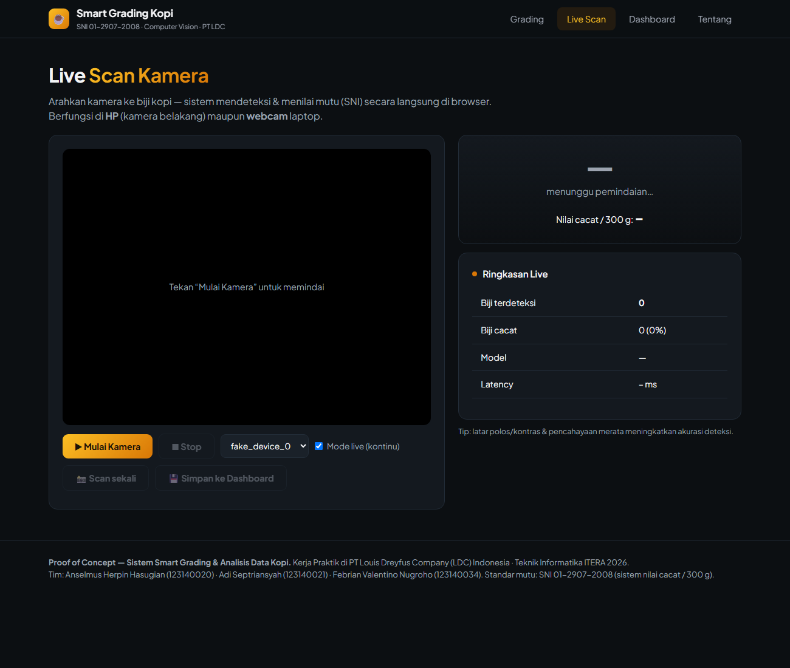
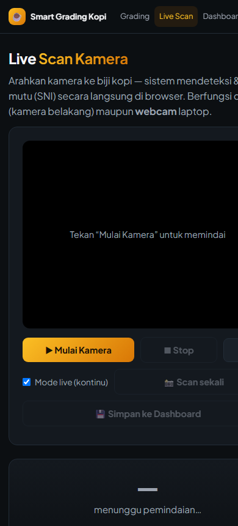
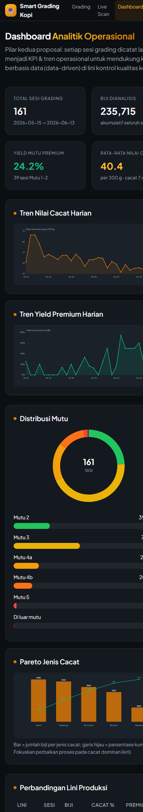
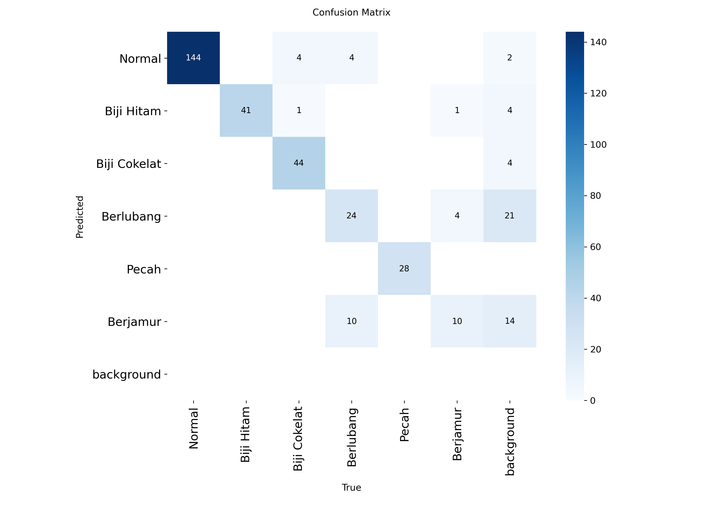
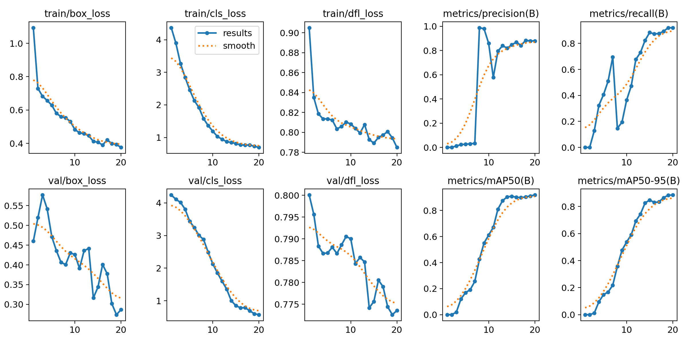

# Dokumentasi Proof of Concept — Smart Grading & Analisis Data Kopi

Dokumentasi lengkap perjalanan PoC dari **`git clone` hingga kondisi sekarang**, untuk
proposal Kerja Praktik di **PT Louis Dreyfus Company (LDC) Indonesia** — Teknik
Informatika ITERA 2026. Tim: Anselmus Herpin Hasugian (123140020), Adi Septriansyah
(123140021), Febrian Valentino Nugroho (123140034).

> Proposal mengusulkan dua pilar: **(1) Smart Grading** biji kopi berbasis Computer
> Vision/AI dan **(2) Analisis Data operasional + dashboard** untuk staf lapangan.

---

## Daftar Isi
1. [Kondisi Awal (saat git clone)](#1-kondisi-awal-saat-git-clone)
2. [Perbaikan Bug](#2-perbaikan-bug)
3. [Mesin Smart Grading SNI 01-2907-2008](#3-mesin-smart-grading-sni-01-2907-2008)
4. [Engine Inferensi Terpadu](#4-engine-inferensi-terpadu)
5. [Analitik Operasional + Dashboard Web](#5-analitik-operasional--dashboard-web)
6. [Live Scan Kamera (HP & Webcam) + Versi Mobile](#6-live-scan-kamera-hp--webcam--versi-mobile)
7. [PoC YOLO Object Detection + Evaluasi ML](#7-poc-yolo-object-detection--evaluasi-ml)
8. [Cara Menjalankan](#8-cara-menjalankan)
9. [Peta Berkas](#9-peta-berkas)
10. [Batasan & Langkah Lanjut](#10-batasan--langkah-lanjut)

---

## 1. Kondisi Awal (saat git clone)

Repositori awal berisi fondasi *Computer Vision* yang dibangun **Febrian** (2 commit,
±4.954 baris) — matang dan rapi:

| Modul | Fungsi |
|---|---|
| `src/config.py` | Konfigurasi terpusat; 6 kelas cacat: Normal, Biji Hitam, Biji Cokelat, Berlubang, Pecah, Berjamur |
| `src/preprocessing.py` | CLAHE, adaptive+Otsu threshold, deteksi biji via kontur, NMS, Auto White Balance, cek kualitas citra, segmentasi K-Means |
| `src/feature_extraction.py` | Fitur warna HSV+LAB, bentuk (Hu moments), tekstur (GLCM, LBP, Sobel) |
| `src/model.py` | Transfer learning EfficientNetB0/MobileNetV2; training 2-fase; cosine-warmup LR; mixup; TTA; Grad-CAM |
| `src/grading_system.py` | Orkestrasi realtime: temporal smoothing, FPS, overlay latency, batch inference |
| `train_model.py` | Pipeline training: class weighting, augmentasi, confusion matrix, classification report |
| `analyze_dataset.py` | Unsupervised PCA + K-Means + Silhouette/ARI + generator dataset sintetis |
| `batch_inference.py` | Proses folder → anotasi + laporan HTML + JSON |

**Gap yang ditemukan:** (a) tidak ada dataset & model terlatih (di-`.gitignore`), (b)
**belum ada logika "grading" mutu lot** (yang ada hanya klasifikasi cacat per-biji),
(c) belum ada analisis data operasional, (d) belum ada dashboard interaktif.

## 2. Perbaikan Bug

| Lokasi | Bug | Perbaikan |
|---|---|---|
| `src/model.py` (`overlay_gradcam`) | `import cv2` ditulis **setelah** pemakaian `cv2.applyColorMap` → `UnboundLocalError` | `import cv2` dipindah ke atas modul |
| `src/preprocessing.py` (`normalize_image`) | Normalisasi `[-1,1]` padahal `keras EfficientNet` punya normalisasi internal & butuh `[0,255]` → fitur backbone nyaris konstan, model **collapse** | Normalisasi sadar-backbone: `[0,255]` untuk EfficientNet |

> Bukti: pelatihan pertama (input `[-1,1]`) akurasi **16,7%** (acak, semua diprediksi
> "Biji Hitam"). Setelah diperbaiki → akurasi validasi **~100%** pada data sintetis.

## 3. Mesin Smart Grading SNI 01-2907-2008

`src/grading_standard.py` — **keystone** yang sebelumnya hilang. Mengubah klasifikasi
cacat per-biji menjadi **mutu lot** berdasarkan **jumlah nilai cacat per 300 g**:

| Mutu | Nilai cacat / 300 g |   | Bobot cacat (Tabel 2 SNI) |
|---|---|---|---|
| Mutu 1 | maks. 11 | | Biji Hitam = 1 |
| Mutu 2 | 12 – 25 | | Biji Cokelat = ¼ |
| Mutu 3 | 26 – 44 | | Pecah = ⅕ |
| Mutu 4a/4b | 45–60 / 61–80 | | Berlubang = ⅕ |
| Mutu 5/6 | 81–150 / 151–225 | | Berjamur = 1⁄10 |

Karena 1 gambar jarang = 300 g, engine **mengekstrapolasi** nilai cacat ke basis 300 g
memakai estimasi massa biji (default Robusta ~0,19 g/biji), semua konfigurabel.

## 4. Engine Inferensi Terpadu

`src/inference_engine.py` (`SmartGradingEngine`) menyatukan rantai:
**Gambar → AWB/cek kualitas → deteksi biji (kontur+NMS) → klasifikasi EfficientNet →
agregasi → grading SNI → anotasi.** Mengembalikan gambar anotasi, jumlah per kelas,
hasil mutu, metrik kualitas, ukuran gambar, dan waktu proses. Model EfficientNet
dilatih ulang via `train_poc.py` (data sintetis tim) → `models/coffee_grading_model.h5`
(val accuracy ~100% pada data sintetis).

Hasil pada 3 sampel lot demo:

| Sampel | Biji | Nilai cacat/300 g | Mutu |
|---|---|---|---|
| Lot Premium | 62 | 0.0 | **Mutu 1** — layak ekspor premium |
| Lot Komersial | 60 | 73.7 | **Mutu 4b** — re-sortasi |
| Lot Mutu Rendah | 56 | 417.3 | **Di luar mutu** — tolak |

## 5. Analitik Operasional + Dashboard Web

- `src/analytics.py` — basis data SQLite (`GradingStore`) + `OperationalAnalytics`:
  KPI, distribusi mutu, tren harian nilai cacat & yield premium, **Pareto jenis cacat**,
  perbandingan lini produksi. Termasuk seeder riwayat **simulasi** untuk demo.
- `webapp/` (Flask) — 3 halaman: **Grading** (upload/sampel → mutu), **Dashboard**
  (analitik), **Tentang**. Grafik SVG murni tanpa CDN (`webapp/charts.py`), tema gelap.



## 6. Live Scan Kamera (HP & Webcam) + Versi Mobile

- `webapp/templates/live.html` — **scan biji langsung dari kamera di browser**
  (WebRTC `getUserMedia`): pemilih kamera (depan/belakang/lainnya), mode live kontinu
  atau scan-sekali, kotak deteksi + mutu digambar real-time, tombol simpan ke dashboard,
  mode kiosk `?autostart=1`. Frame dikirim ke `POST /api/grade` (JSON).
- `webapp/sslcert.py` — sertifikat self-signed (HTTPS) agar **kamera HP** bisa diakses
  via LAN (browser memblokir kamera di origin non-HTTPS). Jalankan `--https`.
- CSS responsif — seluruh situs adaptif untuk layar HP.

| Live (kamera) | Live (mobile) | Dashboard (mobile) |
|---|---|---|
|  |  |  |

## 7. PoC YOLO Object Detection + Evaluasi ML

Selain pipeline klasifikasi (deteksi kontour + EfficientNet), dibangun PoC **object
detection** end-to-end dengan **YOLOv8n** (`yolo_poc/`). Karena posisi biji digenerate
sendiri, label bounding-box YOLO bersifat **ground-truth akurat** tanpa anotasi manual.
Dua dataset dilatih untuk menguji ketahanan metrik:

- **clean** — latar polos, biji terpisah, tanpa noise (analog data internet/Roboflow rapi)
- **hardened** — latar bertekstur/acak, pencahayaan & bayangan bervariasi, oklusi,
  blur/noise, gambar negatif (lebih dekat kondisi lapangan)

### Hasil (YOLOv8n, 20 epoch, imgsz 384, CPU)

| Metrik | clean | hardened |
|---|---|---|
| mAP@0.5 | **0.920** | 0.876 |
| mAP@0.5:0.95 | **0.886** | 0.824 |
| Precision | 0.880 | 0.933 |
| Recall | 0.921 | 0.815 |
| `val_loss` vs `train_loss` | val **<** train (terlalu mudah) | val ≈ train (realistis) |
| **Recall kelas "Berjamur"** | 0.73 | **0.08** |

| Confusion (clean) | Kurva training (clean) |
|---|---|
|  |  |

### Evaluasi (4 poin)

**1) Diagnosa metrik — Overfitting / Underfitting / wajar?**
Tidak overfitting dan tidak underfitting. Kurva loss train≈val turun monoton, mAP tinggi
dan stabil → **konvergen wajar untuk PoC**. Namun nilainya **terlalu tinggi** (mAP@0.5:0.95
0.886). Pada run clean, **`val_loss` justru lebih rendah dari `train_loss`** — sinyal
klasik bahwa validasi **tidak lebih sulit** dari training (distribusi identik). Jadi ini
"sehat secara kurva" tapi "mencurigakan secara nilai".

**2) Indikasi "Internet Bias" / terlalu sempurna / data leakage.**
**Ya, kuat.** mAP@0.5 0.92 + `val_loss < train_loss` adalah ciri dataset yang **terlalu
bersih / kurang variasi background** (dan rawan kebocoran train–val bila gambar mirip).
Buktinya: begitu variasi realistis ditambah (run *hardened*), **recall turun** (0.92→0.82)
dan **kelas sulit "Berjamur" runtuh ke recall 0.08** — artinya angka agregat yang bagus
**menyembunyikan kegagalan per-kelas**. Model bersandar pada isyarat mudah (warna/bentuk
kasar: Pecah/Hitam/Cokelat ~0,99), bukan morfologi cacat halus (lubang/jamur).

**3) Kelayakan konsep (feasibility).**
**Layak (feasible) sebagai konsep.** YOLO terbukti mampu melokalisasi sekaligus
mengklasifikasi biji per jenis cacat dalam satu lintasan, cepat (~21 ms/gambar di CPU),
dan terintegrasi ke grading SNI. Yang **belum** terbukti adalah **kesiapan lapangan** —
angka tinggi berasal dari data sintetis, bukan biji nyata.

**4) Tiga hal paling krusial saat mengambil dataset asli di lapangan.**
1. **Variasi & realisme akuisisi (anti-leakage):** ambil gambar dengan latar, pencahayaan,
   kamera, dan kondiisi biji yang beragam; **split train/val/test per-batch/per-hari**
   (bukan acak per-gambar) agar tidak ada kebocoran; sertakan **gambar negatif**.
2. **Atasi class imbalance kelas sulit (Berjamur/Berlubang):** kumpulkan **lebih banyak
   contoh** kelas minoritas, gunakan resolusi lebih tinggi/zoom untuk cacat halus,
   augmentasi terarah, dan **evaluasi per-kelas (recall)** bukan hanya mAP agregat.
3. **Anotasi & protokol pelabelan yang konsisten:** definisi bbox/kelas mengikuti standar
   SNI, pelabelan oleh QC ahli + double-check, sertakan **test set "liar"** dari lini nyata
   untuk mengukur generalisasi sebenarnya (target realistis mAP turun jauh di bawah PoC).

### "Perbaikan" yang sudah diterapkan
Membuat varian **hardened** (latar acak, oklusi, blur/noise, gambar negatif, scale
bervariasi) — terbukti **menurunkan metrik ke level lebih jujur** dan **mengekspos**
kegagalan kelas Berjamur. Ini pola yang harus diulang dengan data asli.

> Catatan kejujuran: **kedua** dataset masih sintetis. Pada biji nyata, **deteksi** akan
> tetap bekerja tetapi **klasifikasi cacat** menuntut dataset citra asli LDC. Pipeline,
> standar mutu, dan arsitektur sudah final dan siap dialihkan ke data nyata.

## 8. Cara Menjalankan

```bash
pip install -r requirements.txt

# (1) Smart Grading — latih model EfficientNet (data sintetis) lalu jalankan web
python train_poc.py
python webapp/app.py                 # http://127.0.0.1:5000
python webapp/app.py --https         # untuk kamera HP via LAN (https://<IP>:5000/live)

# (2) Demo CLI tanpa browser
python poc_demo.py

# (3) PoC YOLO object detection
python yolo_poc/make_yolo_dataset.py --out yolo_poc/dataset_clean --train 100 --val 25
python yolo_poc/make_yolo_dataset.py --out yolo_poc/dataset_hard --hard --train 120 --val 30
python yolo_poc/train_yolo.py --data yolo_poc/dataset_clean/data.yaml --name clean --epochs 20
python yolo_poc/train_yolo.py --data yolo_poc/dataset_hard/data.yaml --name hardened --epochs 20
```

> Python 3.12/3.13 + TensorFlow ≥ 2.16 memakai Keras 3, sedangkan kode model menargetkan
> Keras 2 → dipakai `tf-keras` dengan `TF_USE_LEGACY_KERAS=1` (entrypoint menyetel otomatis).

### 8.1 Folder yang TIDAK ada di repo & cara membuatnya (penting bagi yang clone)

Beberapa folder **sengaja tidak di-upload** ke GitHub karena berukuran besar dan bisa
dibuat ulang (ada di `.gitignore`). Yang utama: **`data/`** (dataset sintetis biji untuk
melatih EfficientNet) dan **`yolo_poc/dataset_*` + `yolo_poc/runs/`** (dataset & hasil
training YOLO). Semuanya **dibuat OTOMATIS oleh skrip** — tidak perlu di-download manual.

| Folder / artefak (tidak di-repo) | Dibuat oleh perintah |
|---|---|
| `data/normal/`, `data/biji_hitam/`, … (gambar sintetis 6 kelas) | `python train_poc.py` |
| `models/coffee_grading_model.h5` (model EfficientNet terlatih) | `python train_poc.py` |
| `yolo_poc/dataset_clean/`, `yolo_poc/dataset_hard/` (+ `data.yaml`) | `python yolo_poc/make_yolo_dataset.py …` |
| `yolo_poc/runs/clean/`, `yolo_poc/runs/hardened/` (metrik, plot, `weights/best.pt`) | `python yolo_poc/train_yolo.py …` |
| `yolov8n.pt` (bobot pretrained) | ter-download otomatis saat training YOLO |
| `data_store/grading_sessions.db`, `webapp/.certs/` | dibuat otomatis saat `python webapp/app.py` |

**Langkah lengkap setelah `git clone` (urut):**

```bash
# 0) Dependensi (sudah termasuk ultralytics untuk PoC YOLO; menarik torch ~ratusan MB)
pip install -r requirements.txt

# A) Buat folder data/ + latih model EfficientNet  (sekali jalan, ±beberapa menit di CPU)
python train_poc.py
#    -> menghasilkan data/<kelas>/*.jpg (generate_synthetic_dataset)
#    -> melatih & menyimpan models/coffee_grading_model.h5

# B) Buat folder yolo_poc/dataset_* lalu latih YOLO -> menghasilkan yolo_poc/runs/
python yolo_poc/make_yolo_dataset.py --out yolo_poc/dataset_clean --train 100 --val 25
python yolo_poc/make_yolo_dataset.py --out yolo_poc/dataset_hard  --hard --train 120 --val 30
python yolo_poc/train_yolo.py --data yolo_poc/dataset_clean/data.yaml --name clean    --epochs 20
python yolo_poc/train_yolo.py --data yolo_poc/dataset_hard/data.yaml  --name hardened --epochs 20

# C) Jalankan dashboard (data_store/ & sertifikat HTTPS dibuat otomatis)
python webapp/app.py
```

> Catatan: `data/` dan dataset YOLO di sini bersifat **sintetis** (untuk PoC). Untuk
> development nyata, ganti isinya dengan **citra biji kopi asli** — untuk YOLO, anotasi
> bounding-box dalam format YOLO (mis. via Roboflow/CVAT/LabelImg) memakai `data.yaml`
> yang sama; untuk EfficientNet, taruh gambar per kelas di `data/<nama_kelas>/`.

## 9. Peta Berkas

```
src/grading_standard.py    # [BARU] mesin mutu SNI 01-2907-2008
src/inference_engine.py    # [BARU] detect → classify → grade
src/analytics.py           # [BARU] SQLite store + analitik operasional
webapp/app.py              # [BARU] Flask (Grading, Live, Dashboard, Tentang) + HTTPS
webapp/charts.py           # [BARU] grafik SVG tanpa dependensi
webapp/make_samples.py     # [BARU] generator gambar lot demo
webapp/sslcert.py          # [BARU] sertifikat self-signed (kamera HP)
webapp/templates/live.html # [BARU] Live Scan kamera (WebRTC)
train_poc.py / poc_demo.py # [BARU] trainer EfficientNet & demo CLI
yolo_poc/make_yolo_dataset.py  # [BARU] generator dataset deteksi (label YOLO)
yolo_poc/train_yolo.py         # [BARU] trainer YOLOv8n + ringkas metrik
src/model.py, preprocessing.py, feature_extraction.py, grading_system.py,
train_model.py, analyze_dataset.py, batch_inference.py   # tim (Febrian)
```

## 10. Batasan & Langkah Lanjut

- Model & data masih **sintetis** dan sebagian dashboard adalah **simulasi** — diganti
  data asli LDC saat KP tanpa perubahan kode.
- Klasifikasi cacat halus (Berjamur/Berlubang) lemah → butuh data nyata + resolusi tinggi.
- Dua jalur tersedia & saling melengkapi: **klasifikasi** (EfficientNet, sudah jalan di
  web/live) dan **object detection** (YOLO, PoC terbukti feasible) — pemilihan final
  bergantung kebutuhan lapangan (kecepatan, jumlah biji/frame, anotasi tersedia).
- Endpoint `POST /api/grade` (JSON) siap diintegrasikan ke ERP/conveyor/mesin sortasi.
